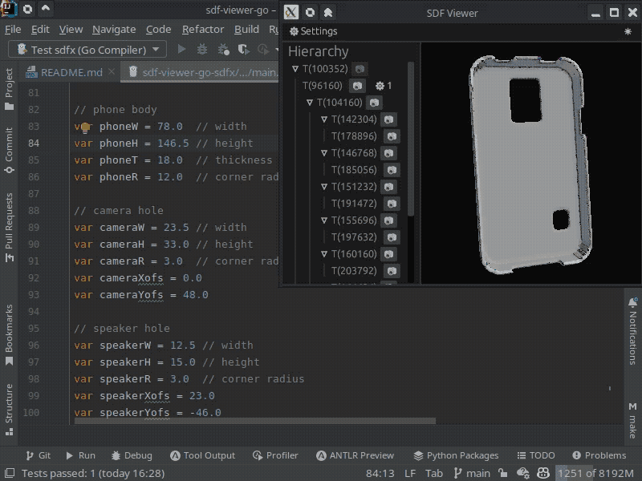

# SDF Viewer Go

SDF Viewer integration for Go libraries.
This allows you to design 3D models in Go using Signed Distance Functions while visualizing the results as fast as
possible.
Check out the [SDF Viewer App's README](https://github.com/Yeicor/sdf-viewer) for more information.

Go modules included in this repository:

- [sdf-viewer-go](sdf-viewer-go): Pure Go implementation of the SDF Viewer
  API. [Usage example](sdf-viewer-go/example/main.go).
- [sdf-viewer-go-auto](sdf-viewer-go-auto): Utilities for the automatic implementation of
  the [sdf-viewer-go](sdf-viewer-go) API.
- [sdf-viewer-go-sdfx](sdf-viewer-go-auto): [SDFX](https://github.com/deadsy/sdfx) implementation of the SDF Viewer
  API. [Usage example](sdf-viewer-go-auto/example/main.go).
- [sdf-viewer-go-sdf](sdf-viewer-go-sdf): [SDF (fork of SDFX by soypat)](https://github.com/soypat/sdf)
  implementation of the SDF Viewer API. [Usage example](sdf-viewer-go-auto/example/main.go).

This project uses [TinyGo](https://tinygo.org) to build the WebAssembly binary (for now) as the Go Compiler can't export
WebAssembly functions. This means that it won't "be able to compile every Go program out there", but should be
good enough for most projects. It is also slower to build (and run) than the Go Compiler.

## Quickstart (SDFX)

Write the following `main.go` file:

```go
package main

import (
  "fmt"
  sdfviewergo "github.com/Yeicor/sdf-viewer-go/sdf-viewer-go"
  sdfviewergosdfx "github.com/Yeicor/sdf-viewer-go/sdf-viewer-go-sdfx"
  . "github.com/deadsy/sdfx/sdf"
  v3 "github.com/deadsy/sdfx/vec/v3"
)

//export init
func init() {
  // This is the only function you need to call to initialize the SDF Viewer.
  sdfviewergo.SetRootSDF(sceneSDF())
}

//placeholder main to allow compilation
func main() {
  fmt.Println("This is not an executable. Compile this with `" +
          "tinygo build -o example.wasm -target wasi -opt 2 -x -no-debug ." +
          "` and use the SDF Viewer app (github.com/Yeicor/sdf-viewer) to visualize the SDF.")
}

// sceneSDF returns the root SDF of the scene.
func sceneSDF() sdfviewergo.SDF {

  // Simple scene:
  box, _ := Box3D(v3.Vec{X: 1., Y: 1., Z: 1.}, 0.25)
  cyl, _ := Cylinder3D(1.5, 0.25, 0.25)
  sdfxSDF := Union3D(box, cyl)
  cyl2, _ := Cylinder3D(1.5, 0.25, 0.25)
  cyl2rot := Transform3D(cyl2, RotateY(DtoR(90)))
  sdfxSDF = Difference3D(sdfxSDF, cyl2rot)

  return sdfviewergosdfx.NewSDF(sdfxSDF)
}

```

The build command is:

```shell
tinygo build -o example.wasm -target wasi -opt 2 -x -no-debug .
```

Then just open the generated WebAssembly file with [SDF Viewer App](https://github.com/Yeicor/sdf-viewer):

```shell
sdf-viewer app url relative/path/to/example.wasm
```

Or, on a web browser that also publishes the WebAssembly file:

`http://localhost:8080/?cliurl=relative/path/to/example.wasm&envdark`

<details>
<summary><b>If you want to automate reloading the object when the source code changes</b></summary>

Set up a server process that will automatically build the WebAssembly file
when the Go file changes, and send the updated file to the SDF Viewer App:

```shell
sdf-viewer server -s relative/path/to/example.wasm -w relative/path/to/main.go -b /bin/sh -b \-c -b "cd relative/path/to/ && tinygo build -o example.wasm -target wasi -opt 2 -x -no-debug -wasm-abi generic ."
```

Connect the app to this server process:

```shell
sdf-viewer app url http://localhost:8080/relative/path/to/example.wasm
```

Or, on a web browser with access to the local server:

`http://localhost:8080/?cliurl=http://localhost:8080/relative/path/to/example.wasm&envdark`

</details>

## Demo: phone case

This is the SDFX example generated from [this](sdf-viewer-go-auto/example/main.go) source file.
[View it online](https://yeicor.github.io/sdf-viewer/?cliurl=https://yeicor.github.io/sdf-viewer-go/sdf-viewer-go-sdfx.wasm&envdark)
or [download](https://yeicor.github.io/sdf-viewer-go/sdf-viewer-go-sdfx.wasm) the WebAssembly file to view it on the
desktop app.



The demo was recorded at a lower framerate, but it runs in real time on an integrated graphics card.
